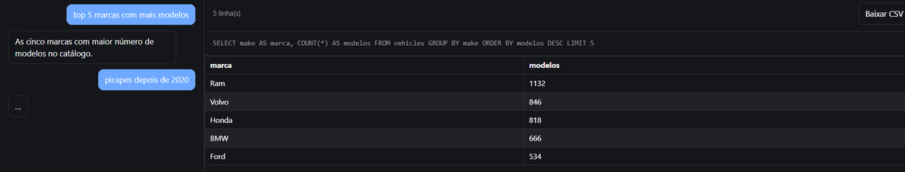

# Chat SQL


Chatbot que traduz perguntas em português para SQL, executa no banco e mostra o
resultado numa planilha que atualiza a cada resposta.

Roda inteiro na sua máquina: modelo local via Ollama, banco SQLite. Sem chave de
API, sem cota, custo zero.



## Rodar

```bash
ollama pull qwen2.5-coder:7b     # ~4,7 GB, uma vez
ollama serve

uvicorn app.main:app --reload
```

O banco de demonstração (`db/analytics.db`, ~276 KB, dados públicos da NHTSA
vPIC) já vem versionado. Para reconstruí-lo do zero: `python db/seed.py`
(algumas centenas de requisições, alguns minutos).

Abra http://localhost:8000

Ou, com o Ollama já rodando no host: `docker compose up --build`

Perguntas de exemplo para o banco de demonstração:

- "quantos modelos a Toyota tem?"
- "quais as 5 marcas com mais modelos?"
- "picapes da Ford depois de 2020"

## Como funciona

`POST /chat` recebe o histórico da conversa, envia o esquema introspectado do
banco para o modelo local, recebe `{sql, note}` com structured outputs, valida e
executa.

Se a consulta falhar — bloqueada pelo guard ou recusada pelo SQLite — o erro
volta para o modelo como uma nova mensagem e ele reescreve a SQL. Até 3
tentativas; depois disso o usuário recebe o erro.

## Segurança

Duas camadas, ambas necessárias:

1. O banco é aberto com `file:...?mode=ro` — o sistema operacional recusa
   escrita, independente de qualquer validação em Python.
2. `app/sql_guard.py` — aceita um único `SELECT`/`WITH`, sem `;` extra e sem
   palavras-chave de escrita.

Além disso: 5s de timeout por consulta e no máximo 500 linhas por resultado.

## Configuração

| Variável | Padrão |
|---|---|
| `OLLAMA_HOST` | `http://localhost:11434` |
| `OLLAMA_MODEL` | `qwen2.5-coder:7b` |
| `DB_PATH` | `db/analytics.db` |

Máquina: o modelo ocupa ~6 GB de RAM. Em CPU, ~10-30s por pergunta; com GPU de
8 GB, ~2-5s. O Ollama atende uma requisição por vez.

## Teste

```bash
python test_sql_guard.py
python test_retry.py
```

## Usar seu próprio banco

Aponte `DB_PATH` para outro arquivo SQLite. O esquema é lido do próprio banco,
mas os exemplos no prompt de `app/main.py` falam de veículos — troque-os pelo
seu domínio, é o que mais afeta a qualidade da SQL gerada.

## Planos

- [PLANO-GRATIS.md](PLANO-GRATIS.md) — o que está em execução
- [PLANO-NUVEM.md](PLANO-NUVEM.md) — alternativa com LLM hospedado, guardada
