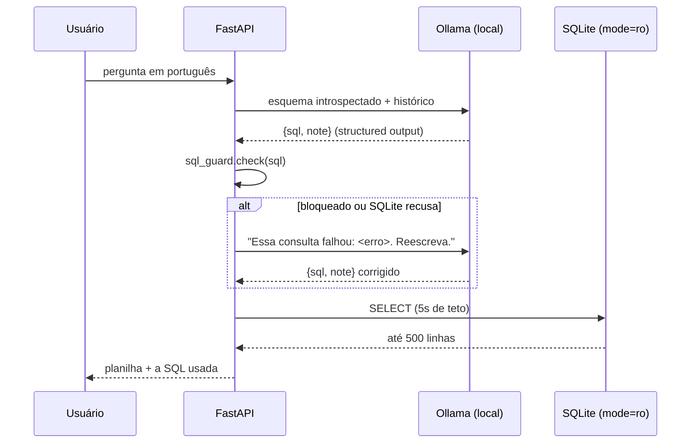

# Chat SQL


Pergunta em português vira SQL, roda num SQLite **aberto em modo somente-leitura pelo
sistema operacional** e volta como planilha. O texto que gera a consulta é escrito por um
usuário e traduzido por um modelo — nenhum dos dois é confiável, e o banco não depende de
nenhum dos dois estar certo.

Roda inteiro na sua máquina: modelo local via Ollama, banco SQLite. Sem chave de API, sem
cota, custo zero.


## O problema

Text-to-SQL é fácil de fazer funcionar e difícil de fazer com segurança. A saída de um LLM
é texto: ele pode alucinar uma tabela, encadear dois comandos, ou ser convencido pela
pergunta a escrever um `DELETE`. Se essa string chega ao banco sem barreira, o modelo
virou seu DBA.

Aqui ele não vira. Duas camadas, e a de baixo não é código meu:

```bash
# 1. O arquivo recusa escrita — nenhuma validação em Python envolvida
python -c "import sqlite3; sqlite3.connect('file:db/analytics.db?mode=ro', uri=True).execute('DELETE FROM vehicles')"
# sqlite3.OperationalError: attempt to write a readonly database

# 2. E o guard recusa antes de chegar lá
python -c "from app.sql_guard import check; check('SELECT 1; DROP TABLE vehicles')"
# UnsafeQuery: mais de um comando SQL não é permitido

python -c "from app.sql_guard import check; check(\"SELECT load_extension('/tmp/x.so')\")"
# UnsafeQuery: comando não permitido: LOAD_EXTENSION
```

As duas existem porque protegem contra coisas diferentes. `mode=ro` é a garantia real —
vale mesmo se o guard tiver um furo. O guard existe para devolver um erro legível, para
bloquear payload multi-comando antes de sair da aplicação, e para cobrir o caso que
`mode=ro` **não** cobre: `load_extension` carrega código nativo de dentro de um `SELECT`
perfeitamente válido, sem escrever um byte no banco.

Detalhes do guard que não são acidentais:

- Comentários (`--`, `/* */`) são removidos **antes** da verificação, para não recusarem
  consulta legítima: `SELECT make FROM vehicles -- delete depois` passa, e deve passar.
- A lista proibida casa palavra inteira: uma coluna `created_at` não pode disparar `create`.
- Entradas de Postgres (`pg_read_file`, `lo_import`, `dblink`) ficam na lista mesmo o banco
  sendo SQLite, para o guard continuar valendo se apontarem a app para um Postgres.

## O retry

O modelo não enxerga o guard nem o banco. Erro que ele não lê é erro que ele repete.

Quando a consulta falha — bloqueada pelo guard, recusada pelo SQLite, ou estourando o
timeout — o texto do erro volta como uma nova mensagem e o modelo reescreve. Até 3
tentativas; depois disso o usuário recebe o erro.



O esquema é introspectado do banco vivo a cada requisição (`PRAGMA table_info`), não
escrito à mão — apontar para outro SQLite funciona sem tocar em código.

O modelo também pode responder que **não dá**: se a pergunta não couber no esquema, ele
devolve `sql` vazio e explica em `note`. "Qual o faturamento do mês passado?" num banco que
só tem catálogo de veículos não vira uma consulta inventada.

## Rodar

```bash
ollama pull qwen2.5-coder:7b     # ~4,7 GB, uma vez
ollama serve

uvicorn app.main:app --reload
```

Abra http://localhost:8000

Ou, com o Ollama já rodando no host: `docker compose up --build`

O banco de demonstração (`db/analytics.db`, ~276 KB, dados públicos da NHTSA vPIC) já vem
versionado. Para reconstruí-lo do zero: `python db/seed.py` (algumas centenas de
requisições, alguns minutos).

Perguntas de exemplo:

- "quantos modelos a Toyota tem?"
- "quais as 5 marcas com mais modelos?"
- "picapes da Ford depois de 2020"
- "qual o faturamento do mês passado?" — devolve a recusa explicada

## Limites de execução

| | |
|---|---|
| Timeout por consulta | 5s, via `set_progress_handler` — aborta no meio da varredura |
| Linhas por resposta | 500, com sinalização de truncado |
| Histórico enviado | 6 turnos (modelo local reprocessa o contexto inteiro a cada chamada) |
| Timeout do Ollama | 120s |

O timeout de consulta não é cosmético: um `SELECT` sem `LIMIT` numa tabela grande seguraria
a requisição inteira. Ao abortar, o erro do SQLite entra no mesmo laço de retry e o modelo
reescreve com limite.

## Configuração

| Variável | Padrão |
|---|---|
| `OLLAMA_HOST` | `http://localhost:11434` |
| `OLLAMA_MODEL` | `qwen2.5-coder:7b` |
| `DB_PATH` | `db/analytics.db` |

Máquina: o modelo ocupa ~6 GB de RAM. Em CPU, ~10-30s por pergunta; com GPU de 8 GB,
~2-5s. O Ollama atende uma requisição por vez.

## Teste

```bash
python test_sql_guard.py
python test_retry.py
# ou, com pytest instalado, ambos de uma vez: pytest
```

## Usar seu próprio banco

Aponte `DB_PATH` para outro arquivo SQLite. O esquema é lido do próprio banco, mas os
exemplos no prompt de `app/main.py` falam de veículos — troque-os pelo seu domínio, é o que
mais afeta a qualidade da SQL gerada.

## Limites conhecidos

- **O guard é lista negra, não gramática.** Um parser SQL de verdade (`sqlglot`) seria mais
  robusto que regex. A escolha aqui foi deliberada: `mode=ro` é a garantia que sustenta o
  sistema, e o guard é a segunda camada. Trocar por parser é a evolução natural se a app
  passar a apontar para um banco onde o usuário do banco tenha permissão de escrita.
- **Uma requisição por vez.** É limite do Ollama, não da app. Concorrência exige fila ou
  mais de uma instância do modelo.
- **Sem cache de esquema.** Introspecção a cada requisição — barata em um banco de uma
  tabela, cara em um de centenas.

## Planos

- [docs/PLANO-GRATIS.md](docs/PLANO-GRATIS.md) — o que está em execução
- [docs/PLANO-NUVEM.md](docs/PLANO-NUVEM.md) — alternativa com LLM hospedado, guardada
